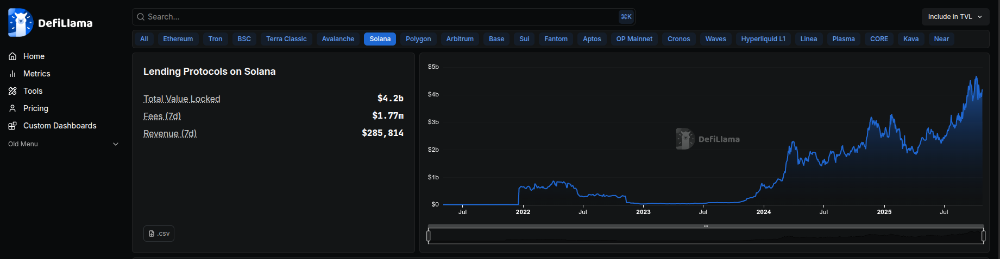

# Business Report v1.0 — Market & Viability   (ZK Coprocessor Bridge)

**Date:** Oct 2025

## 📊 Summary & Market
We provide a **ZK Coprocessor Bridge SDK** (plus optional managed relayer/prover) that lets Solana apps trigger **private ZK compute on Aztec** via Ethereum/Wormhole with replay‑safe finality.

- **Market snapshot (as of Oct 2025):** Solana Lending TVL ≈ **$4.2B** (DeFiLlama snapshot). Ethereum ZK/L2 ecosystems secure significant value, indicating sustained demand for privacy + interoperability rails.

  

- **Comparable models:**  
  - **RISC Zero (Bonsai):** remote proving with verifiable receipts (usage‑based).  
  - **Succinct (SP1):** zkVM + prover network / coprocessor model (per‑proof/volume).  
  - **Arcium (DeCC):** encrypted compute via MPC; job‑based confidential workloads.  
These validate usage‑based monetization for ZK/secure compute and inform our pricing posture.

## 📈 Model & Scenarios
**Monetization (SKUs):**
- **SDK (self‑hosted):** bps on private‑compute volume or per‑message fee.
- **Managed (relayer/prover):** per‑proof fee + SLA.
- **Enterprise:** base platform fee + usage.

**Formulas (for transparent, adjustable modeling):**
- **LP APR (if used with asset‑lock pools):**  
  `APR ≈ fee_rate × monthly_velocity × 12 × LP_share`
- **SDK ARR:**  
  `ARR = TVL_captured × monthly_velocity × 12 × fee_rate × SDK_share`

**Scenario ranges (illustrative, narrowed spread):**

| Case         | TVL_captured | fee_rate | monthly_velocity | LP/SDK split | **LP APR** | **SDK ARR** |
|--------------|-------------:|---------:|-----------------:|-------------:|-----------:|------------:|
| Conservative | $300M        | 20 bp    | 0.4×             | 70% / 30%    | **0.67%**  | **$0.86M**  |
| Base         | $500M        | 30 bp    | 0.5×             | 70% / 30%    | **1.26%**  | **$2.70M**  |
| Upside       | $700M        | 40 bp    | 0.7×             | 75% / 25%    | **2.52%**  | **$5.88M**  |

**Assumptions (compact):**
- `TVL_captured` = incremental privacy‑enabled flows tapping EVM‑side ZK liquidity.
- `monthly_velocity` = average monthly turnover of those balances.
- Fees charged on **private‑compute bridging volume** (enqueue/consumption), not passive TVL.

**Go‑to‑Market (first 2–3 quarters):**
- **Design partners:** 1–2 Solana lenders + 1 Aztec app → SDK v0.1 + managed relayer.
- **Pricing pilot:** bps on processed private‑compute volume (rebate for early adopters).
- **Proof points:** monthly **volume / success rate / latency / unit cost** (public dashboard).

## 🔗 References
- DeFiLlama — Lending on Solana (TVL snapshot). <https://defillama.com/>  
- L2BEAT — Total Value Secured (TVS) and ecosystem context. <https://l2beat.com/>  
- RISC Zero Docs (Bonsai, receipts). <https://docs.risczero.com/>  
- Succinct / SP1 zkVM. <https://docs.succinct.xyz/> · <https://github.com/succinctlabs>  
- Arcium Docs (DeCC/MPC). <https://docs.arcium.com/>
